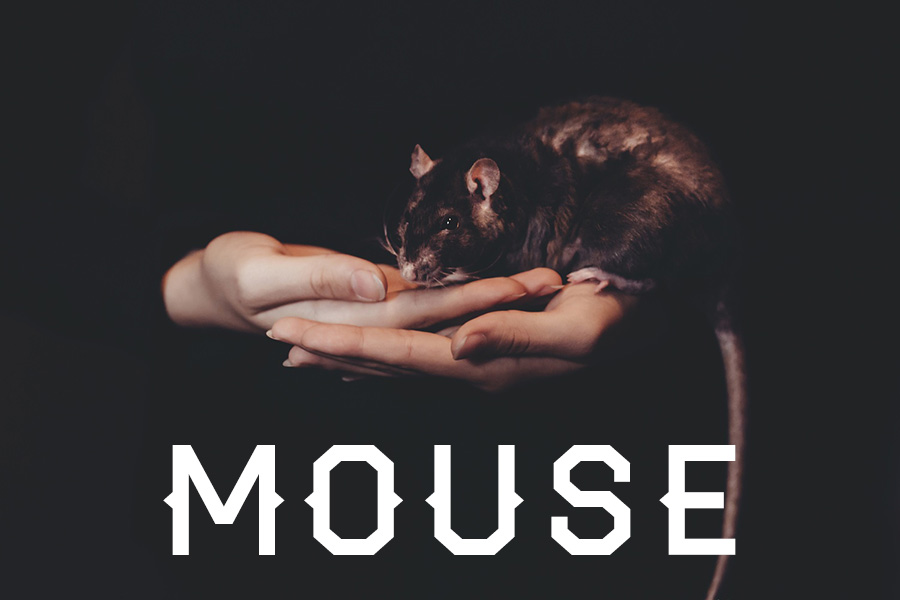

A scriptable, configuration powered IRC bot that can handle as many connnections as you want.

## Table of Contents

1. [Installing](#installing)
    1. [Building from source](#building-from-source)
    2. [Downloading a binary](#downloading-a-binary)
2. [Configuring](#configuring)
    1. [Choosing a configuration type](#choosing-a-configuration-type)
        1. [Configuring with TOML](#configuring-with-toml)
        2. [Configuring with JSON](#configuring-with-json)
        3. [Configuring with HCL](#configuring-with-hcl)
        4. [Configuring with YAML](#configuring-with-yaml)
        5. [Configuring with Java Properties](#configuring-with-java-properties)
    2. [Configuration options](#configuration-options)
        1. [Nick](#nick)
        2. [User](#user)
        3. [Name](#name)
        4. [Host](#host)
        5. [Port](#port)
        6. [TLS](#tls)
        7. [Reconnect](#reconnect)
        8. [Debug](#debug)
        9. [Channels](#channels)
        10. [Plugins](#plugins)
            1. [Enabled](#enabled)
            2. [Folders](#folders)
            3. [Pattern](#pattern)
            4. [Events](#events)
3. [Extending Mouse with plugins](#extending-mouse-with-plugins)
    1. [Language choices](#language-choices)
        1. [JavaScript](#javascript)
        2. [Lua](#lua)
    2. [Global functions](#global-functions)
        1. [Join](#join)
        2. [Part](#part)
        3. [Cycle](#cycle)
        4. [Say](#say)
        5. [Kick](#kick)
        6. [Ban](#ban)
        7. [Unban](#unban)
        8. [Op](#op)
        9. [Deop](#deop)
    3. [Global data](#global-data)
        1. [Event](#event)
            1. [Command](#command)
            2. [Channel](#channel)
            3. [Message](#message)
            4. [Host](#host-1)
            5. [Nick](#nick-2)
            6. [User](#user-3)
4. [Contributing](#contributing)
5. [License](#license)

## Installing

### Building from source

Mouse is built on [Go](https://golang.org/), and uses [GB](https://getgb.io/) to vendor code. You should always be using the most recent version of both.

```bash
gb build all
```

### Downloading a binary

This option is currently not available, but will be once Mouse hits version `1.0.0`, and for each release after that.

## Configuring

Your configuration file can exist at any of the following locations:

```bash
/etc/mouse/
$HOME/.mouse/
./
```

The name of your configuration file should always be `mouse`, but the file extension depends on the configuration type that you use.

### Choosing a configuration type

Mouse uses the [Viper](https://github.com/spf13/viper) library, which allows a variety of configuration types. Your configuration file must be named appropriately and should be one of the following:

```bash
mouse.toml
mouse.json
mouse.hcl
mouse.yaml
mouse.properties
```

Keep in mind that a configuration file named `mouse.toml` MUST be a TOML file, and the same goes for every other supported configuration file type.

#### Configuring with TOML

You can choose to configure Mouse with [TOML](https://github.com/toml-lang/toml). Configure your servers like this:

```toml
[servers]

    [server.a]
        nick = "mouse"

        # ...

        [servers.a.plugins.javascript]
            enabled = true

            # ...

    [server.b]
        nick = "mouse"

        # ...
```

You can see a full example at [contrib/config-examples/config.toml](contrib/config-examples/config.toml).

### Configuring with JSON

You can choose to configure Mouse with [JSON](http://www.json.org/). Configure your servers like this:

```json
{
    "servers": {
        "a": {
            "nick": "mouse",
            "plugins": {
                "javascript": {
                    "enabled": true
                }
            }
        },
        "b": {
            "nick": "mouse"
        }
    }
}
```

You can see a full example at [contrib/config-examples/config.json](contrib/config-examples/config.json).

#### Configuring with HCL

You can choose to configure Mouse with [HCL](https://github.com/hashicorp/hcl). Configure your servers like this:

```hcl
servers "a" {
    nick = "mouse"

    # ...

    plugins "javascript" {
        enabled = true

        # ...
    }
}

servers "b" {
    nick = "mouse"

    # ...
}
```

You can see a full example at [contrib/config-examples/config.hcl](contrib/config-examples/config.hcl).

#### Configuring with YAML

You can choose to configure Mouse with [YAML](http://yaml.org/). Configure your servers like this:

```yaml
servers:
    a:
        nick: mouse
        # ...

        plugins:
            javascript:
                enabled: true
                # ...
    b:
        nick: mouse
        # ...
```

You can see a full example at [contrib/config-examples/config.yaml](contrib/config-examples/config.yaml).

#### Configuring with Java Properties

You can choose to configure Mouse with [Java Properties](http://docs.oracle.com/javase/tutorial/essential/environment/properties.html).

```properties
servers.a.nick = "mouse"
# ...
servers.a.plugins.javascript.enabled = true
# ...

servers.b.nick = "mouse"
# ...
```

You can see a full example at [contrib/config-examples/config.properties](contrib/config-examples/config.properties).

### Configuration options

All of the following configuration options should be nested in a server block. See [above](#choosing-a-configuration-type) to find a full example of the configuration file type that you're using.

#### Nick

Nick is a string and the name that the bot will use once connected to the IRC server.

```toml
nick = "mouse"
```

#### User

User is a string and contains the username of the user.

```toml
user = "mouse"
```

#### Name

Name is a string and the real name of the bot.

```toml
name = "mouse"
```

#### Host

Host is a string that specifies what server to connect to. This should not include the port.

```toml
host = "irc.fc00.io"
```

#### Port

Port is an integer that specifies the port on the IRC server to connect to.

```toml
port = 6667
```

#### TLS

Currently does nothing.

```toml
tls = false
```

#### Reconnect

Reconnect is a boolean that when `true` will try to reconnect to the server if disconnected from.

```toml
reconnect = true
```

#### Debug

Debug is a boolean that prints every IRC event for all connected servers to STDOUT.

```toml
debug = false
```

#### Channels

Channels is an array of strings that represent channels to join once connected to the IRC server. If the channel contains a password, it should be placed after the channel name with a space in between like `#c` is in the example below.

```toml
channels = [ "#a", "#b", "#c password" ]
```

#### Plugins

All of the following configuration options should be nested in a plugins block named for the plugin language to be configured. See [below](#extending-mouse-with-plugins) for more information on plugins.

##### Enabled

Enabled is a boolean that enables and disables plugin support for the specific plugin language.

```toml
enabled = true
```

##### Folders

Folders is an array of strings that contains a directory path for plugin files. This does not include a pattern, as the pattern attribute [below](#pattern) decides what the pattern is for plugin files. A good use of multiple folders that contain scripts could be certain scripts that only one bot should access, and some scripts that all bots should access.

```toml
folders = [ "/home/username/.mouse/scripts/language/" ]
```

##### Pattern

Pattern is a string that contains the pattern for plugin files. This does not include the folder, as the folder attribute [above](#folder) decides where to look for the pattern.

```toml
pattern = "*.js"
```

##### Events

Events is an array of strings that contain official IRC event types that the plugins should run on.

```toml
events = [ "PRIVMSG" ]
```

## Extending Mouse with plugins

### Language Choices

#### JavaScript

Using the embeddable JavaScript interpreter [Otto](https://github.com/robertkrimen/otto), we can write plugins that deeply integrate with Mouse.

#### Lua

Coming soon.

### Global Functions

#### Join

The `join` function allows your bot to join a new channel. You may also specify a password if the channel has a password set, but that's not required. If there is a password, append it to the channel parameter with a space in between.

```javascript
/**
 * @param string channel
 */
function join(channel)
```

#### Part

The `part` function allows your bot to part a channel.

```javascript
/**
 * @param string channel
 */
function part(channel)
```

#### Cycle

The `cycle` function allows your bot to cycle on a channel. This will leave the channel, and then re-join it.

```javascript
/**
 * @param string channel
 */
function cycle(channel)
```

#### Say

The `say` function allows your bot to send messages to any buffer that will allow it. When sending to a channel, the channel name must be prefixed with `#`, and when sending to a user, it should not be.

```javascript
/**
 * @param string buffer
 * @param string message
 */
function say(buffer, message)
```

#### Kick

The `kick` function allows your bot to kick users out of a channel. You may also specify a reason, but that's not required.

```javascript
/**
 * @param string channel
 * @param string user
 * @param string reason
 */
function kick(channel, user, reason)
```

#### Ban

The `ban` function allows your bot to ban users in a channel. You may also specify a reason, but that's not required.

```javascript
/**
 * @param string channel
 * @param string user
 * @param string reason
 */
function ban(channel, user, reason)
```

#### Unban

The `unban` function allows your bot to unban users in a channel.

```javascript
/**
 * @param string channel
 * @param string user
 */
function unban(channel, user)
```

#### Op

The `op` function allows your bot to change the mode of a user to `+o` in a channel.

```javascript
/**
 * @param string channel
 * @param string user
 */
function op(channel, user)
```

#### Deop

The `deop` function allows your bot to change the mode of a user to `-o` in a channel.

```javascript
/**
 * @param string channel
 * @param string user
 */
function deop(channel, user)
```

### Global Data

There are variables set at the global scope that can be used in all plugins.

#### Event

On each event that the plugins are listening for, a new event is populated that is passed in to an `event` object in the global scope.

##### Command

Command is a string that contains the command that triggered this event. The most frequently used command in Mouse plugins is probably [`"PRIVMSG"`](https://tools.ietf.org/html/rfc2812#section-3.3.1).

```javascript
event.command
```

##### Channel

Channel is a string that contains the channel where the event took place. Channel is not just for channels, but also for private messages. If it is a channel, it will be prefixed with `#`.

```javascript
event.channel
```

##### Message

Message is a string that contains the message of the event.

```javascript
event.message
```

##### Host

Host is a string that contains the host of the user that triggered this event.

```javascript
event.host
```

##### Nick

Nick is a string that contains the nick of the user that triggered this event.

```javascript
event.nick
```

##### User

User is a string that contains the user of the user that triggered this event.

```javascript
event.user
```

## Contributing

Want to contribute? Do it. Read the [contributing guidelines](CONTRIBUTING.md) first.

## License

Mouse is licensed under [MIT](LICENSE.md).
